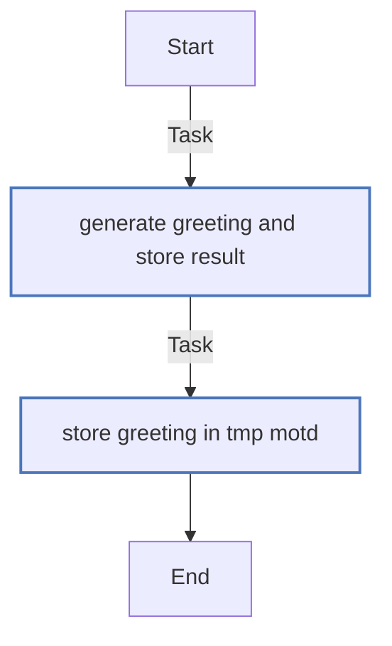
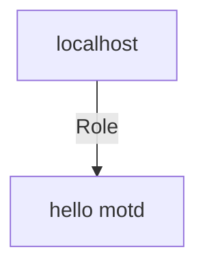

<!-- STATIC CONTENT START
Use this section for adding additional content to the README
This will not be overwritten by Docsible -->
# 📃 Role overview

<!-- STATIC CONTENT END -->
<!-- DOCSIBLE START -->
## hello_motd

```
Role belongs to example/demo
Namespace - example
Collection - demo
Version - 2.0.7
Repository - https://github.com/open-appdev-lab/demo-ansible-collection
```

Description: example role

| Field                | Value           |
|--------------------- |-----------------|
| Readme update        | 2025/12/26 |

### Defaults

**These are static variables with lower priority**

#### File: defaults/main.yml

| Var          | Type         | Value       |Choices    |Required    | Title       |
|--------------|--------------|-------------|-------------|-------------|-------------|
| [`hello_motd_friend_name`](defaults/main.yml#L3)   | str   | `John Doe` |  None  |   None  |  None |

<summary><b>🖇️ Full descriptions for vars in defaults/main.yml</b></summary>
<br>
<b>`hello_motd_friend_name`:</b> None
<br>
<br>

### Tasks

#### File: tasks/main.yml

| Name | Module | Has Conditions |
| ---- | ------ | --------- |
| Generate greeting and store result | `ansible.builtin.set_fact` | False |
| Store greeting in /tmp/motd | `ansible.builtin.copy` | False |

## Task Flow Graphs

### Graph for main.yml



## Playbook

```yml
# SPDX-License-Identifier: MIT-0
---
- name: Test MOTD role
  hosts: localhost
  remote_user: root
  roles:
    - hello_motd
...

```

## Playbook graph



## Author Information

Lucas Burigo

## License

MIT

## Minimum Ansible Version

2.1

## Platforms

No platforms specified.

<!-- DOCSIBLE END -->